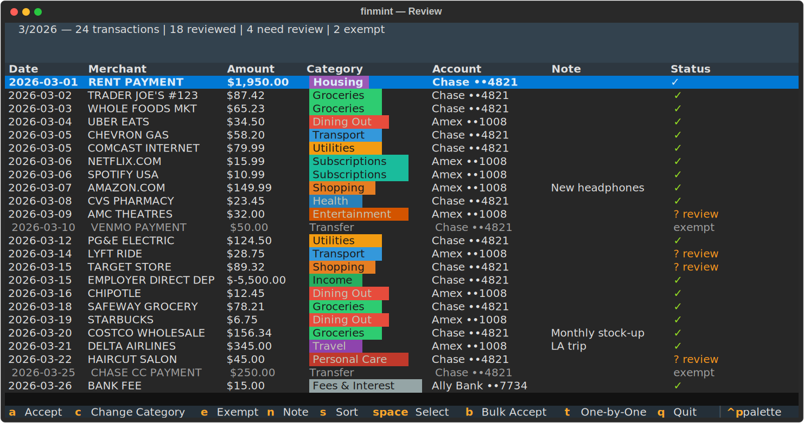
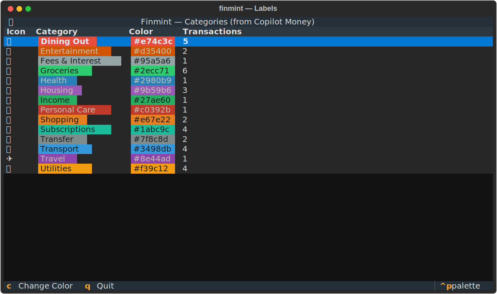
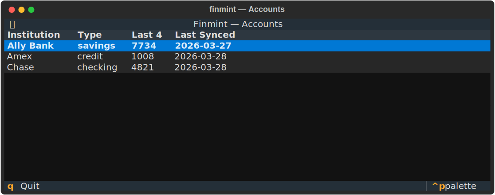
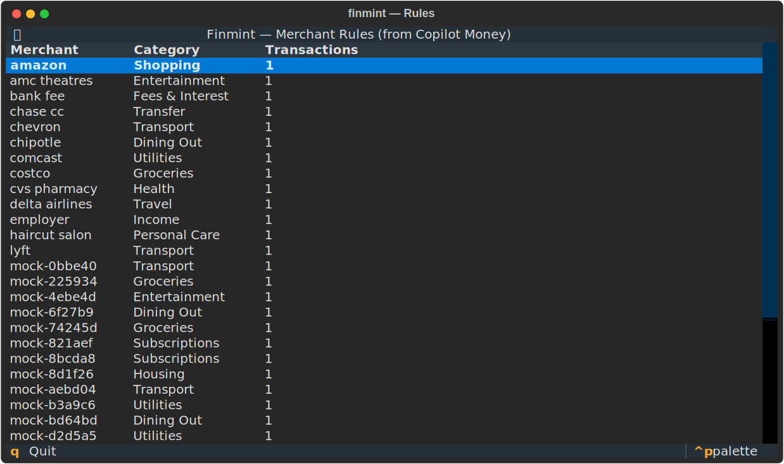

# Finmint CLI

Unofficial CLI-based wrapper for [Copilot Money](https://copilot.money) - auto-categorize with AI, review interactively, and visualize spending.

> **Disclaimer:** This project is **not affiliated with, endorsed by, or associated with Copilot Money (Copilot IQ, Inc.)** in any way. It uses a reverse-engineered, unofficial API that may break at any time. **This tool is not financial advice.** Use at your own risk. See [LEGAL.md](LEGAL.md) for full details.



## Features

- Fetch transactions from all connected bank accounts via Copilot Money
- AI-powered auto-categorization via Claude API, with local merchant rules that learn from your corrections
- Interactive TUI for reviewing and categorizing transactions
- Custom notes on individual transactions
- Color-coded category labels with customizable colors
- Sortable transaction tables (by any column, ascending or descending)
- Pie charts (monthly) and bar charts (yearly) for spending visualization
- AI-generated narrative summaries of your spending patterns
- Manage labels, accounts, and merchant rules from the terminal

## Install

```bash
pip install -e .
```

## Setup

1. **Copilot Money account**: Sign up at [copilot.money](https://copilot.money) and connect your bank accounts.

2. **Claude API key**: Get an API key from [Anthropic](https://console.anthropic.com/). This is a paid API -- you are responsible for any charges incurred.

3. **Set your API key**:

   ```bash
   export ANTHROPIC_API_KEY=sk-ant-...
   ```

4. **Set your Copilot Money token**:

   ```bash
   finmint token
   ```

   This prompts you to paste a JWT from the Copilot Money web app (browser dev tools -> Network tab -> Authorization header). Tokens expire periodically and will need to be refreshed.

5. **Sync and review**:
   ```bash
   finmint 3-2026
   ```

## Usage

```bash
# Review and categorize this month's transactions
finmint 3-2026

# View spending breakdown with pie chart and AI summary
finmint view 3-2026

# View yearly overview with bar chart
finmint view 2026

# Set or refresh your Copilot Money token
finmint token

# View connected bank accounts
finmint accounts

# Manage category labels
finmint labels

# Manage merchant categorization rules
finmint rules
```

### Review TUI Keybindings

| Key     | Action                                   |
| ------- | ---------------------------------------- |
| `a`     | Accept transaction's current category    |
| `c`     | Change category                          |
| `e`     | Exempt transaction from review           |
| `n`     | Add/edit a note on the transaction       |
| `s`     | Sort by column (opens picker)            |
| `Space` | Toggle selection for bulk operations     |
| `b`     | Bulk accept all selected transactions    |
| `t`     | Toggle between table and one-by-one view |
| `q`     | Quit                                     |

Click any column header to sort by that column. Click again to reverse. Click a third time to clear the sort.

## Screenshots

### Labels Manager

Create, rename, recolor, and delete category labels.



### Accounts

View all connected bank accounts and their sync status.



### Rules Manager

Manage merchant-to-category rules that auto-categorize future transactions.



## Security

All credentials stay on your machine. See [SECURITY.md](SECURITY.md) for the full security policy and vulnerability reporting.

## Legal

See [LEGAL.md](LEGAL.md) for disclaimers, warranty, and trademark notices.

## License

[MIT](LICENSE)
